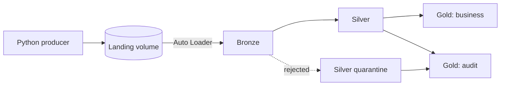
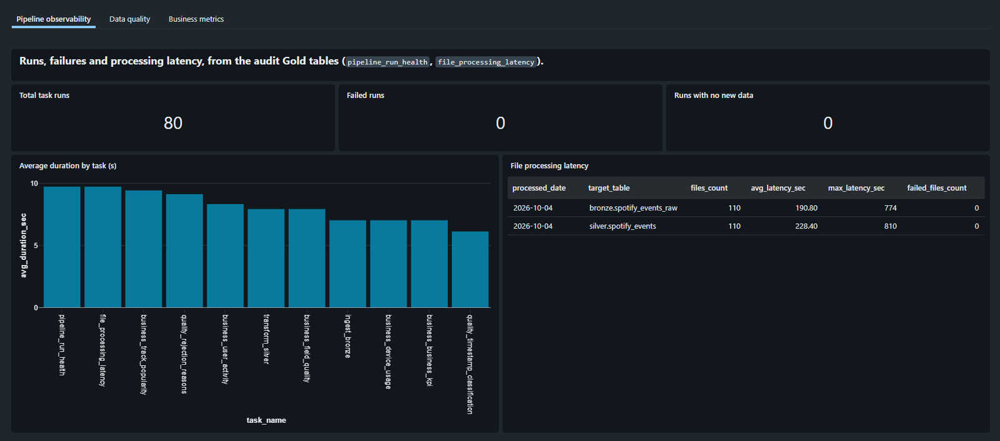
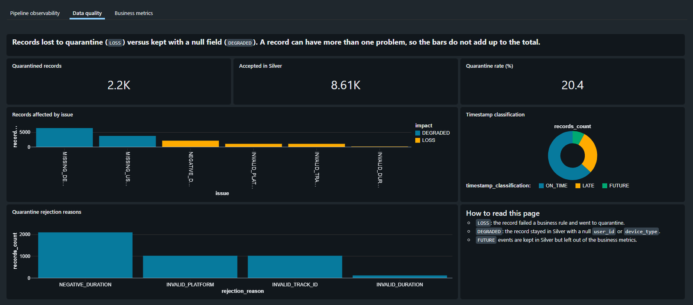
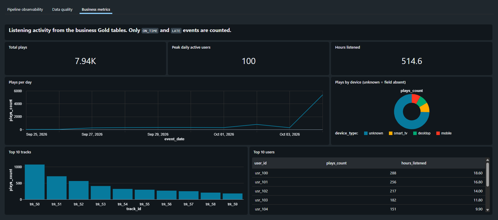

**English** | [Português](README.pt-BR.md)

# Databricks Medallion Pipeline


A data engineering pipeline on Azure Databricks that follows the Medallion architecture (Bronze, Silver and Gold). It simulates the play events of a music streaming platform and is built on Unity Catalog and Databricks Asset Bundles.

## Table of contents

- [Overview](#overview)
- [Architecture](#architecture)
- [Project structure](#project-structure)
- [Getting started](#getting-started)
- [Data quality scenarios](#data-quality-scenarios)
- [Layers](#layers)
- [Dashboard](#dashboard)
- [Auditing](#auditing)
- [Testing](#testing)
- [Roadmap](#roadmap)

## Overview

The project reproduces common ingestion challenges: incremental files, null values, missing keys, schema evolution, inconsistent types and duplicate records. Its purpose is to exercise resilience, traceability and governance in a Lakehouse.

Highlights:

- **Auto Loader** ingestion with schema evolution in `rescue` mode, so schema drift is never silently dropped.
- **Quarantine** for invalid records, with the rejection reason preserved.
- **Idempotent** Delta writes and deduplication with a deterministic tie-break.
- **Auditing** per batch and per file, plus Gold tables for pipeline observability.
- **Business Gold tables** (popularity, device usage, user activity, KPIs and a per-field data quality report).
- A **single orchestrator job** that chains Bronze, Silver and Gold, plus a separate producer job that simulates the arrival of files.
- Pure transformation logic in `src/pipeline/`, covered by `pytest` without a cluster.

## Architecture



Unity Catalog objects (catalog `databricks_course_ws_new`):

| Layer | Object |
| --- | --- |
| Landing | `landing.events_volume` (volume) |
| Bronze | `bronze.spotify_events_raw` |
| Silver | `silver.spotify_events`, `silver.spotify_events_quarantine` |
| Gold (audit) | `gold.pipeline_run_health`, `gold.file_processing_latency`, `gold.data_quality_summary` |
| Gold (business) | `gold.track_popularity_daily`, `gold.device_usage_daily`, `gold.user_activity_daily`, `gold.business_kpi_daily`, `gold.field_quality` |
| Ops | `ops.checkpoints_volume` (volume), `ops.pipeline_audit`, `ops.file_audit` |

The `landing` volume stores the source files. The `ops` volume keeps the Auto Loader checkpoints and schema. The audit tables record aggregated metrics per batch and detailed metrics per file.

## Project structure

```text
.
├── databricks.yml          # Asset Bundle: jobs, dashboard and variables
├── pyproject.toml          # Project metadata and Databricks Connect environment settings
├── setup.py                # Makes src/ importable (pip install -e .)
├── notebooks/              # Orchestration (Spark / streaming adapters)
│   ├── ingest_bronze.py
│   ├── silver_transform.py
│   ├── gold_pipeline_run_health.py
│   ├── gold_file_processing_latency.py
│   ├── gold_data_quality_summary.py
│   └── gold_business_metrics.py
├── src/
│   ├── pipeline/           # Pure, testable transformation logic
│   │   ├── silver.py
│   │   ├── gold.py
│   │   ├── metrics.py
│   │   └── audit.py
│   └── producer/
│       └── producer_simulator.py
├── tests/                  # pytest suite
├── dashboards/
│   └── medallion.lvdash.json   # AI/BI dashboard (3 pages), deployed by the bundle
└── docs/
    ├── auditing.md
    ├── auditing.pt-BR.md       # Portuguese version
    ├── error-handling.md
    └── error-handling.pt-BR.md # Portuguese version
```

The notebooks only orchestrate (reading, `foreachBatch`, `MERGE`, writes and auditing). Deterministic business rules live in `src/pipeline/` so they can be tested locally.

## Getting started

### Prerequisites

- Python 3.12 (required by Databricks Connect 16.4).
- The [Databricks CLI](https://docs.databricks.com/dev-tools/cli/) with a profile configured for your workspace (`databricks configure`).
- A cluster with access to the Unity Catalog objects above, and a SQL warehouse for the dashboard.

### Installation

Create a virtual environment, install the dependencies and then the project itself in editable mode, which makes `src/` importable:

```powershell
py -3.12 -m venv .venv
.venv\Scripts\activate
pip install "databricks-connect~=16.4.0" "pytest~=8.3.0"
pip install -e .
```

`pip install -e .` alone does not install the dependencies: they are declared in the `dev` group of `pyproject.toml`, which `pip` does not read by default. `uv sync` is not supported: the `dev` group conflicts with versions pinned by Databricks in `pyproject.toml`. Use `pip` as described above.

### Configuration

`databricks.yml` does not store a workspace host, a profile or any cluster or warehouse id. Provide them through environment variables before using the bundle (PowerShell):

```powershell
$env:DATABRICKS_CONFIG_PROFILE = "<your-profile>"        # its host is the workspace that is used
$env:BUNDLE_VAR_cluster_id     = "<your-cluster-id>"     # cluster that runs the jobs
$env:BUNDLE_VAR_warehouse_id   = "<your-warehouse-id>"   # SQL warehouse that runs the dashboard
```

To keep them across sessions, define the same variables with `setx` or in the Windows environment settings. Alternatively, pass a profile with `-p <your-profile>` and the variables with `--var="cluster_id=..."` on every command. Without these values, `bundle deploy` fails because the defaults in `databricks.yml` are placeholders.

### Running the pipeline

Validate and deploy the bundle:

```powershell
databricks bundle validate -t dev
databricks bundle deploy -t dev
```

The producer job (`producer_simulator`) only simulates files arriving in the landing volume; it is not part of the ingestion. Run it to generate new files:

```powershell
databricks bundle run producer_simulator -t dev
```

The orchestrator job (`medallion_pipeline`) chains Bronze, Silver and the Gold tasks, and is what would be scheduled in production:

```powershell
databricks bundle run medallion_pipeline -t dev
```

To see the whole flow end to end, run the demo job (`demo_end_to_end`), which runs the producer and then the orchestrator:

```powershell
databricks bundle run demo_end_to_end -t dev
```

Or run each stage of the pipeline on its own:

```powershell
databricks bundle run bronze_ingestion -t dev
databricks bundle run silver_transformation -t dev
databricks bundle run gold_aggregation -t dev
databricks bundle run gold_business -t dev
```

All jobs use the cluster set in the `cluster_id` variable of [databricks.yml](databricks.yml).

The volume of generated data is controlled by the bundle variables `num_files`, `min_records`, `max_records`, `interval_sec` and `days_back`. Bundle variables are resolved at **deploy** time, so to backfill history deploy with the variable set, run, and then deploy again with the default:

```powershell
databricks bundle deploy -t dev --var="days_back=7"
databricks bundle run demo_end_to_end -t dev
databricks bundle deploy -t dev
```

### Resetting the pipeline

`TRUNCATE` is **not** enough to start over. The Bronze table is written with `txnAppId`/`txnVersion` (the batch id), which Delta stores in the table log. After the checkpoints are deleted the batch id restarts at 0 and Delta silently discards the writes as replays. To reset:

1. `DROP TABLE` the Bronze table.
2. Delete every directory under `ops/checkpoints_volume`.
3. `TRUNCATE` the Silver, quarantine, Gold audit and `ops` tables (the business Gold tables are recreated on every run).

The files in the landing volume can be kept: without a checkpoint they are ingested again. The Bronze notebook also fails a batch whose written row count does not match the rows it read, so a discarded write cannot be reported as a success.

## Data quality scenarios

The producer in [src/producer/producer_simulator.py](src/producer/producer_simulator.py) deliberately generates:

| Condition (record index `i`) | Scenario |
| --- | --- |
| `i % 3 == 0` | `user_id` is null |
| `i % 4 == 0` | extra `device_type` attribute (schema drift) |
| `i % 7 == 0` | `user_id` key is missing |
| `i == 9` | `duration_played_sec = "INVALID_DURATION"` (inconsistent type) |
| `i % 5 == 0` and `i != 0` | `duration_played_sec = -10` (out of domain) |
| `i % 13 == 0` and `i != 0` | late timestamp (2 days ago) |
| `i % 11 == 0` | future timestamp (+1 day) |
| `i % 10 == 0` and `i != 0` | empty `track_id` and `platform` |
| last record of each file | conflicting duplicate of the first record (same `event_id`) |

`user_id` (a pool of 100) and `track_id` (a pool of 60) are drawn at random with decreasing weights, so some tracks are popular and users listen to several tracks. `event_id` combines the file's `batch_id` with the record index.

The producer writes JSON Lines files, so it simulates a file-based incremental source rather than a real-time streaming broker.

## Layers

### Bronze

[notebooks/ingest_bronze.py](notebooks/ingest_bronze.py) uses:

- Auto Loader with `cloudFiles.format = json`;
- `cloudFiles.schemaLocation` to persist the schema;
- `schemaEvolutionMode = rescue`, so schema changes are kept in `_rescued_data`;
- `_ingested_at` and `_source_file` for lineage;
- `trigger(availableNow=True)` to process the available files and stop;
- `foreachBatch` to compute per-batch and per-file metrics;
- one Delta transaction per batch (`txnAppId`/`txnVersion`) so reprocessing a batch does not duplicate data.

`rescue` mode handles compatible schema changes. It does not replace business validation.

### Silver and quarantine

[notebooks/silver_transform.py](notebooks/silver_transform.py) applies the rules implemented and tested in [src/pipeline/silver.py](src/pipeline/silver.py):

- `duration_played_sec` is cast to an integer when possible;
- invalid or out-of-domain values (for example negative durations) go to quarantine;
- records without `user_id` stay in the Silver table with `NULL`, because the focus is aggregate listening behavior rather than individual recommendations;
- `timestamp` is parsed into `event_timestamp` and classified as `ON_TIME`, `LATE`, `FUTURE` or `INVALID`;
- `event_id` is the global event identifier, and duplicates are reduced to the record with the latest `_ingested_at` (ties broken by `_source_file`);
- `track_id`, `platform`, `duration_played_sec` and `timestamp` are essential: if one is missing or invalid the record goes to quarantine;
- `_rescued_data` is preserved.

Silver columns:

```text
event_id, user_id, track_id, platform, device_type, duration_played_sec,
event_timestamp, timestamp_classification, _rescued_data, _ingested_at, _source_file
```

Rejected records are kept in `silver.spotify_events_quarantine` with a `rejection_reason`: `INVALID_EVENT_ID`, `INVALID_TRACK_ID`, `INVALID_PLATFORM`, `INVALID_DURATION`, `NEGATIVE_DURATION` or `INVALID_TIMESTAMP` (several reasons can be combined).

### Gold: audit

The `gold_aggregation` job runs three incremental tasks (streaming + `trigger(availableNow=True)` + checkpoint + additive `MERGE`), powered by [src/pipeline/gold.py](src/pipeline/gold.py):

- **`gold.pipeline_run_health`**: executions, successes, failures, empty runs, average duration and processed or rejected volume per day, pipeline and task.
- **`gold.file_processing_latency`**: latency between file generation (the timestamp in the file name) and processing.
- **`gold.data_quality_summary`**: quarantine rejection reasons and the distribution of `timestamp_classification`, in long format (`event_date, metric_type, category, records_count`).

### Gold: business

The `gold_business` job ([notebooks/gold_business_metrics.py](notebooks/gold_business_metrics.py)) rebuilds five tables from scratch on every run. A full rebuild is used instead of an incremental load because the Silver table is updated through `MERGE ... UPDATE` and because distinct counts cannot be summed across runs.

- **`gold.track_popularity_daily`**: plays, duration and distinct users per day and track.
- **`gold.device_usage_daily`**: plays, duration and `share_pct` per day and device; a missing `device_type` appears as `unknown`.
- **`gold.user_activity_daily`**: plays, duration and distinct tracks per day and identified user.
- **`gold.business_kpi_daily`**: daily KPIs, including `pct_without_user` and `pct_without_device`.
- **`gold.field_quality`**: which fields hurt the data the most, either as `LOSS` (the record goes to quarantine) or `DEGRADED` (a null field, but the record stays in the Silver table), with `pct_of_total`.

Business metrics only consider `ON_TIME` and `LATE` events.

## Dashboard

[dashboards/medallion.lvdash.json](dashboards/medallion.lvdash.json) is an AI/BI (Lakeview) dashboard kept as code and deployed together with the bundle (`resources.dashboards` in [databricks.yml](databricks.yml)). It has three pages, all built from the Gold tables:

- **Pipeline observability**: task runs, failures, runs with no new data, average duration per task and file processing latency.
- **Data quality**: quarantine and acceptance counts and rate, records affected per issue (`LOSS` vs `DEGRADED`), rejection reasons and the timestamp classification.
- **Business metrics**: total plays, peak daily active users, hours listened, plays per day, top tracks, plays per device and top users.







It needs a SQL warehouse, set in the `warehouse_id` bundle variable. Opening the dashboard starts the warehouse and runs its queries, which has a small cost. The queries use the catalog `databricks_course_ws_new` as written.

The bundle refuses to deploy when the dashboard was saved from the web interface after the last deployment (`modified remotely`). Review what changed and, only if you are sure nothing there needs to be kept, deploy with `--force`.

## Auditing

[src/pipeline/audit.py](src/pipeline/audit.py) provides the reusable implementation, and [docs/auditing.md](docs/auditing.md) documents the tables and ready-made queries.

`pipeline_audit` has one row per batch or execution, or a row with `batch_id = -1` when a run finds no new data (common to Bronze, Silver and Gold). `file_audit` has one row per processed file (Bronze and Silver) with counts, status and error message. The Gold tasks do not use `file_audit` because they aggregate tables, not files. The statuses are `SUCCESS` and `FAILED`.

## Testing

The pure transformation logic in `src/pipeline/` is covered by `pytest` and needs no cluster:

```powershell
py -3.12 -m pytest tests/ -v
```

The `silver.py` and `gold.py` tests need a local `SparkSession` (which requires a JDK). In environments with `databricks-connect`, which only accepts remote sessions, they are skipped automatically and the rest of the suite runs.

## Roadmap

- Close the loop on bad records: a status for quarantined rows and a `reprocess_quarantine` job. See [docs/error-handling.md](docs/error-handling.md) for how teams handle rescued and quarantined data and a design proposal.
- Plan the catalog layout before starting a new project. This workspace shares one catalog across several portfolio projects, so schemas named after the layers (`bronze`, `silver`, `gold`) end up mixing tables from different projects. One option is a catalog per project, and in any case the catalog name should be a bundle variable instead of being hard-coded in notebooks, dashboard queries and docs. This is a reminder that comes from the portfolio setup, not a general recommendation: in a company the catalog usually follows environments or business domains.

## About this project

Developed with the assistance of an AI coding assistant; architecture, data-quality rules and validation against a real workspace were driven and reviewed by the author.
