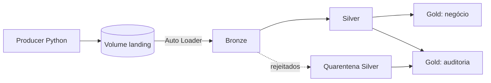

[English](README.md) | **Português**

# Databricks Medallion Pipeline


Um pipeline de engenharia de dados no Azure Databricks que segue a arquitetura Medalhão (Bronze, Silver e Gold). Ele simula os eventos de reprodução de uma plataforma de streaming de música e é construído sobre Unity Catalog e Databricks Asset Bundles.

## Sumário

- [Visão geral](#visão-geral)
- [Arquitetura](#arquitetura)
- [Estrutura do projeto](#estrutura-do-projeto)
- [Primeiros passos](#primeiros-passos)
- [Cenários de qualidade de dados](#cenários-de-qualidade-de-dados)
- [Camadas](#camadas)
- [Dashboard](#dashboard)
- [Auditoria](#auditoria)
- [Testes](#testes)
- [Roadmap](#roadmap)

## Visão geral

O projeto reproduz desafios comuns de ingestão: arquivos incrementais, valores nulos, chaves ausentes, evolução de schema, tipos inconsistentes e registros duplicados. O objetivo é exercitar resiliência, rastreabilidade e governança em um Lakehouse.

Destaques:

- Ingestão com **Auto Loader** e evolução de schema no modo `rescue`, de modo que mudanças de schema nunca são descartadas silenciosamente.
- **Quarentena** para registros inválidos, com o motivo da rejeição preservado.
- Escritas Delta **idempotentes** e deduplicação com critério de desempate determinístico.
- **Auditoria** por lote e por arquivo, além de tabelas Gold para a observabilidade do pipeline.
- **Tabelas Gold de negócio** (popularidade, uso por dispositivo, atividade de usuários, KPIs e um relatório de qualidade de dados por campo).
- Um **job orquestrador** que encadeia Bronze, Silver e Gold, mais um job separado do producer que simula a chegada dos arquivos.
- Lógica de transformação pura em `src/pipeline/`, coberta por `pytest` sem precisar de cluster.

## Arquitetura



Objetos do Unity Catalog (catálogo `databricks_course_ws_new`):

| Camada | Objeto |
| --- | --- |
| Landing | `landing.events_volume` (volume) |
| Bronze | `bronze.spotify_events_raw` |
| Silver | `silver.spotify_events`, `silver.spotify_events_quarantine` |
| Gold (auditoria) | `gold.pipeline_run_health`, `gold.file_processing_latency`, `gold.data_quality_summary` |
| Gold (negócio) | `gold.track_popularity_daily`, `gold.device_usage_daily`, `gold.user_activity_daily`, `gold.business_kpi_daily`, `gold.field_quality` |
| Ops | `ops.checkpoints_volume` (volume), `ops.pipeline_audit`, `ops.file_audit` |

O volume `landing` guarda os arquivos de origem. O volume `ops` mantém os checkpoints e o schema do Auto Loader. As tabelas de auditoria registram métricas agregadas por lote e métricas detalhadas por arquivo.

## Estrutura do projeto

```text
.
├── databricks.yml          # Asset Bundle: jobs, dashboard e variáveis
├── pyproject.toml          # Metadados do projeto e configurações do ambiente Databricks Connect
├── setup.py                # Torna src/ importável (pip install -e .)
├── notebooks/              # Orquestração (adaptadores Spark / streaming)
│   ├── ingest_bronze.py
│   ├── silver_transform.py
│   ├── gold_pipeline_run_health.py
│   ├── gold_file_processing_latency.py
│   ├── gold_data_quality_summary.py
│   └── gold_business_metrics.py
├── src/
│   ├── pipeline/           # Lógica de transformação pura e testável
│   │   ├── silver.py
│   │   ├── gold.py
│   │   ├── metrics.py
│   │   └── audit.py
│   └── producer/
│       └── producer_simulator.py
├── tests/                  # Suíte do pytest
├── dashboards/
│   └── medallion.lvdash.json   # Dashboard AI/BI (3 páginas), implantado pelo bundle
└── docs/
    ├── auditing.md             # (English)
    ├── auditing.pt-BR.md
    ├── error-handling.md       # (English)
    └── error-handling.pt-BR.md
```

Os notebooks apenas orquestram (leitura, `foreachBatch`, `MERGE`, escritas e auditoria). As regras de negócio determinísticas ficam em `src/pipeline/` para poderem ser testadas localmente.

## Primeiros passos

### Pré-requisitos

- Python 3.12 (exigido pelo Databricks Connect 16.4).
- A [Databricks CLI](https://docs.databricks.com/dev-tools/cli/) com um profile configurado para o seu workspace (`databricks configure`).
- Um cluster com acesso aos objetos do Unity Catalog acima e um SQL warehouse para o dashboard.

### Instalação

Crie um ambiente virtual, instale as dependências e depois o próprio projeto em modo editável, o que torna `src/` importável:

```powershell
py -3.12 -m venv .venv
.venv\Scripts\activate
pip install "databricks-connect~=16.4.0" "pytest~=8.3.0"
pip install -e .
```

Só o `pip install -e .` não instala as dependências: elas estão declaradas no grupo `dev` do `pyproject.toml`, que o `pip` não lê por padrão. O `uv sync` não é suportado: o grupo `dev` entra em conflito com versões fixadas pelo Databricks no `pyproject.toml`. Use o `pip`, como descrito acima.

### Configuração

O `databricks.yml` não guarda o host do workspace, um profile nem ids de cluster ou de warehouse. Informe-os por variáveis de ambiente antes de usar o bundle (PowerShell):

```powershell
$env:DATABRICKS_CONFIG_PROFILE = "<seu-profile>"          # o host dele é o workspace usado
$env:BUNDLE_VAR_cluster_id     = "<id-do-seu-cluster>"    # cluster que executa os jobs
$env:BUNDLE_VAR_warehouse_id   = "<id-do-seu-warehouse>"  # SQL warehouse que executa o dashboard
```

Para mantê-las entre sessões, defina as mesmas variáveis com `setx` ou nas configurações de ambiente do Windows. Como alternativa, passe um profile com `-p <seu-profile>` e as variáveis com `--var="cluster_id=..."` em cada comando. Sem esses valores, o `bundle deploy` falha, porque os padrões do `databricks.yml` são marcadores de posição.

### Executando o pipeline

Valide e implante o bundle:

```powershell
databricks bundle validate -t dev
databricks bundle deploy -t dev
```

O job do producer (`producer_simulator`) apenas simula a chegada de arquivos no volume landing; ele não faz parte da ingestão. Execute-o para gerar novos arquivos:

```powershell
databricks bundle run producer_simulator -t dev
```

O job orquestrador (`medallion_pipeline`) encadeia Bronze, Silver e as tarefas Gold, e é o que seria agendado em produção:

```powershell
databricks bundle run medallion_pipeline -t dev
```

Para ver o fluxo completo de ponta a ponta, execute o job de demonstração (`demo_end_to_end`), que executa o producer e depois o orquestrador:

```powershell
databricks bundle run demo_end_to_end -t dev
```

Ou execute cada etapa do pipeline isoladamente:

```powershell
databricks bundle run bronze_ingestion -t dev
databricks bundle run silver_transformation -t dev
databricks bundle run gold_aggregation -t dev
databricks bundle run gold_business -t dev
```

Todos os jobs usam o cluster definido na variável `cluster_id` do [databricks.yml](databricks.yml).

O volume de dados gerados é controlado pelas variáveis do bundle `num_files`, `min_records`, `max_records`, `interval_sec` e `days_back`. As variáveis do bundle são resolvidas no momento do **deploy**; por isso, para carregar histórico, faça o deploy com a variável definida, execute e depois faça um novo deploy com o valor padrão:

```powershell
databricks bundle deploy -t dev --var="days_back=7"
databricks bundle run demo_end_to_end -t dev
databricks bundle deploy -t dev
```

### Reiniciando o pipeline

`TRUNCATE` **não** basta para recomeçar. A tabela Bronze é escrita com `txnAppId`/`txnVersion` (o id do lote), que o Delta guarda no log da tabela. Depois que os checkpoints são apagados, o id do lote volta a 0 e o Delta descarta silenciosamente as escritas como se fossem reprocessamentos. Para reiniciar:

1. Execute `DROP TABLE` na tabela Bronze.
2. Apague todos os diretórios dentro de `ops/checkpoints_volume`.
3. Execute `TRUNCATE` nas tabelas Silver, de quarentena, Gold de auditoria e `ops` (as tabelas Gold de negócio são recriadas a cada execução).

Os arquivos do volume landing podem ser mantidos: sem checkpoint, eles são ingeridos novamente. O notebook Bronze também falha um lote cuja contagem de linhas escritas não bate com a de linhas lidas, para que uma escrita descartada não seja registrada como sucesso.

## Cenários de qualidade de dados

O producer em [src/producer/producer_simulator.py](src/producer/producer_simulator.py) gera, de propósito:

| Condição (índice do registro `i`) | Cenário |
| --- | --- |
| `i % 3 == 0` | `user_id` nulo |
| `i % 4 == 0` | atributo extra `device_type` (schema drift) |
| `i % 7 == 0` | chave `user_id` ausente |
| `i == 9` | `duration_played_sec = "INVALID_DURATION"` (tipo inconsistente) |
| `i % 5 == 0` e `i != 0` | `duration_played_sec = -10` (fora do domínio) |
| `i % 13 == 0` e `i != 0` | timestamp atrasado (2 dias atrás) |
| `i % 11 == 0` | timestamp futuro (+1 dia) |
| `i % 10 == 0` e `i != 0` | `track_id` e `platform` vazios |
| último registro de cada arquivo | duplicata conflitante do primeiro registro (mesmo `event_id`) |

`user_id` (um conjunto de 100) e `track_id` (um conjunto de 60) são sorteados com pesos decrescentes, de modo que algumas faixas são populares e os usuários ouvem várias faixas. O `event_id` combina o `batch_id` do arquivo com o índice do registro.

O producer escreve arquivos JSON Lines, portanto simula uma fonte incremental baseada em arquivos, e não um broker de streaming em tempo real.

## Camadas

### Bronze

O [notebooks/ingest_bronze.py](notebooks/ingest_bronze.py) usa:

- Auto Loader com `cloudFiles.format = json`;
- `cloudFiles.schemaLocation` para persistir o schema;
- `schemaEvolutionMode = rescue`, de modo que mudanças de schema ficam em `_rescued_data`;
- `_ingested_at` e `_source_file` para linhagem;
- `trigger(availableNow=True)` para processar os arquivos disponíveis e parar;
- `foreachBatch` para calcular métricas por lote e por arquivo;
- uma transação Delta por lote (`txnAppId`/`txnVersion`), para que reprocessar um lote não duplique dados.

O modo `rescue` trata mudanças de schema compatíveis. Ele não substitui a validação de negócio.

### Silver e quarentena

O [notebooks/silver_transform.py](notebooks/silver_transform.py) aplica as regras implementadas e testadas em [src/pipeline/silver.py](src/pipeline/silver.py):

- `duration_played_sec` é convertido para inteiro quando possível;
- valores inválidos ou fora do domínio (por exemplo, durações negativas) vão para a quarentena;
- registros sem `user_id` permanecem na tabela Silver com `NULL`, porque o foco é o comportamento agregado de escuta, e não recomendações individuais;
- `timestamp` é interpretado em `event_timestamp` e classificado como `ON_TIME`, `LATE`, `FUTURE` ou `INVALID`;
- `event_id` é o identificador global do evento, e as duplicatas são reduzidas ao registro com o `_ingested_at` mais recente (empates resolvidos por `_source_file`);
- `track_id`, `platform`, `duration_played_sec` e `timestamp` são essenciais: se um deles estiver ausente ou inválido, o registro vai para a quarentena;
- `_rescued_data` é preservado.

Colunas da Silver:

```text
event_id, user_id, track_id, platform, device_type, duration_played_sec,
event_timestamp, timestamp_classification, _rescued_data, _ingested_at, _source_file
```

Os registros rejeitados ficam em `silver.spotify_events_quarantine` com um `rejection_reason`: `INVALID_EVENT_ID`, `INVALID_TRACK_ID`, `INVALID_PLATFORM`, `INVALID_DURATION`, `NEGATIVE_DURATION` ou `INVALID_TIMESTAMP` (vários motivos podem ser combinados).

### Gold: auditoria

O job `gold_aggregation` executa três tarefas incrementais (streaming + `trigger(availableNow=True)` + checkpoint + `MERGE` aditivo), com base em [src/pipeline/gold.py](src/pipeline/gold.py):

- **`gold.pipeline_run_health`**: execuções, sucessos, falhas, execuções vazias, duração média e volume processado ou rejeitado por dia, pipeline e tarefa.
- **`gold.file_processing_latency`**: latência entre a geração do arquivo (o timestamp no nome do arquivo) e o processamento.
- **`gold.data_quality_summary`**: motivos de rejeição da quarentena e a distribuição de `timestamp_classification`, em formato longo (`event_date, metric_type, category, records_count`).

### Gold: negócio

O job `gold_business` ([notebooks/gold_business_metrics.py](notebooks/gold_business_metrics.py)) reconstrói cinco tabelas do zero a cada execução. Usa-se a reconstrução completa em vez de carga incremental porque a tabela Silver é atualizada por `MERGE ... UPDATE` e porque contagens distintas não podem ser somadas entre execuções.

- **`gold.track_popularity_daily`**: reproduções, duração e usuários distintos por dia e faixa.
- **`gold.device_usage_daily`**: reproduções, duração e `share_pct` por dia e dispositivo; um `device_type` ausente aparece como `unknown`.
- **`gold.user_activity_daily`**: reproduções, duração e faixas distintas por dia e usuário identificado.
- **`gold.business_kpi_daily`**: KPIs diários, incluindo `pct_without_user` e `pct_without_device`.
- **`gold.field_quality`**: quais campos mais prejudicam os dados, como `LOSS` (o registro vai para a quarentena) ou `DEGRADED` (um campo nulo, mas o registro permanece na tabela Silver), com `pct_of_total`.

As métricas de negócio consideram apenas eventos `ON_TIME` e `LATE`.

## Dashboard

O [dashboards/medallion.lvdash.json](dashboards/medallion.lvdash.json) é um dashboard AI/BI (Lakeview) mantido como código e implantado junto com o bundle (`resources.dashboards` no [databricks.yml](databricks.yml)). Ele tem três páginas, todas construídas a partir das tabelas Gold:

- **Pipeline observability**: execuções de tarefas, falhas, execuções sem dados novos, duração média por tarefa e latência de processamento de arquivos.
- **Data quality**: contagens e taxa de quarentena e de aceitação, registros afetados por problema (`LOSS` vs `DEGRADED`), motivos de rejeição e a classificação de timestamp.
- **Business metrics**: total de reproduções, pico de usuários ativos por dia, horas ouvidas, reproduções por dia, principais faixas, reproduções por dispositivo e principais usuários.

Os títulos e rótulos do dashboard estão em inglês.


Ele precisa de um SQL warehouse, definido na variável do bundle `warehouse_id`. Abrir o dashboard inicia o warehouse e executa as consultas dele, o que tem um pequeno custo. As consultas usam o catálogo `databricks_course_ws_new`, como está escrito.

O bundle se recusa a fazer o deploy quando o dashboard foi salvo pela interface web depois do último deploy (`modified remotely`). Revise o que mudou e, somente se tiver certeza de que nada ali precisa ser mantido, faça o deploy com `--force`.

## Auditoria

O [src/pipeline/audit.py](src/pipeline/audit.py) fornece a implementação reutilizável, e o [docs/auditing.pt-BR.md](docs/auditing.pt-BR.md) documenta as tabelas e traz consultas prontas.

A `pipeline_audit` tem uma linha por lote ou execução, ou uma linha com `batch_id = -1` quando uma execução não encontra dados novos (comum a Bronze, Silver e Gold). A `file_audit` tem uma linha por arquivo processado (Bronze e Silver), com contagens, status e mensagem de erro. As tarefas Gold não usam a `file_audit`, porque agregam tabelas, e não arquivos. Os status são `SUCCESS` e `FAILED`.

## Testes

A lógica de transformação pura em `src/pipeline/` é coberta pelo `pytest` e não precisa de cluster:

```powershell
py -3.12 -m pytest tests/ -v
```

Os testes de `silver.py` e `gold.py` precisam de uma `SparkSession` local (que exige um JDK). Em ambientes com `databricks-connect`, que só aceita sessões remotas, eles são ignorados automaticamente e o restante da suíte roda.

## Roadmap

- Fechar o ciclo dos registros ruins: um status para as linhas em quarentena e um job `reprocess_quarantine`. Veja [docs/error-handling.pt-BR.md](docs/error-handling.pt-BR.md) para saber como as equipes tratam dados resgatados e em quarentena, e uma proposta de desenho.
- Planejar a organização do catálogo antes de começar um novo projeto. Este workspace compartilha um catálogo entre vários projetos de portfólio; assim, schemas com nome de camada (`bronze`, `silver`, `gold`) acabam misturando tabelas de projetos diferentes. Uma opção é um catálogo por projeto e, em qualquer caso, o nome do catálogo deve ser uma variável do bundle, em vez de ficar escrito diretamente em notebooks, consultas de dashboard e documentos. É um lembrete que vem da configuração do portfólio, e não uma recomendação geral: em uma empresa, o catálogo geralmente segue ambientes ou domínios de negócio.

## Sobre este projeto

Desenvolvido com o apoio de um assistente de programação com IA; a arquitetura, as regras de qualidade de dados e a validação em um workspace real foram conduzidas e revisadas pelo autor.
